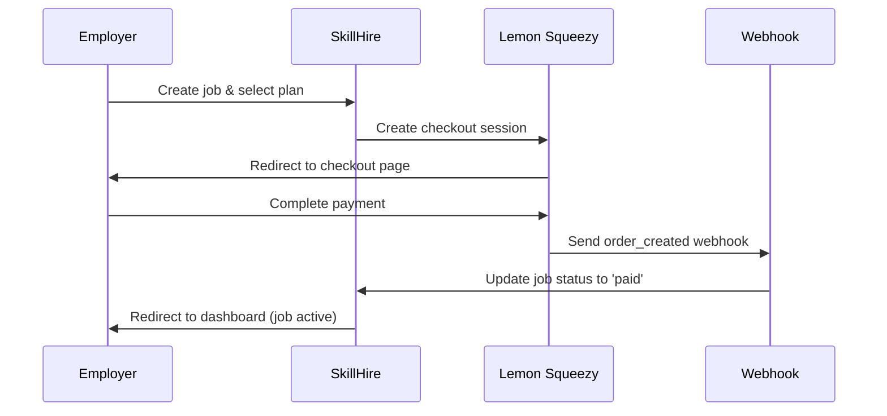

# Payment System Migration: Stripe → Lemon Squeezy

## Migration Complete ✅

Your payment system has been successfully migrated from Stripe to Lemon Squeezy!

## What Changed

### 📦 Packages
- ❌ Removed: `stripe`, `@stripe/stripe-js`
- ✅ Added: `@lemonsqueezy/lemonsqueezy.js`

### 🗂️ Files Modified

#### New Files
- `lib/lemonsqueezy.ts` - Lemon Squeezy configuration
- `app/api/webhooks/lemonsqueezy/route.ts` - Webhook handler for payment events
- `LEMONSQUEEZY_SETUP.md` - Complete setup guide

#### Updated Files
- `components/payment-button.tsx` - Updated to use Lemon Squeezy checkout
- `app/api/payments/create-checkout-session/route.ts` - Creates Lemon Squeezy checkout sessions
- `lib/models/Job.ts` - Changed `stripeSessionId` to `lemonSqueezyOrderId`
- `env.example` - Updated environment variables for Lemon Squeezy

#### Deleted Files
- `lib/stripe.ts` - Stripe server configuration (no longer needed)
- `lib/stripe-client.ts` - Stripe client configuration (no longer needed)
- `app/api/webhooks/stripe/route.ts` - Stripe webhook handler (replaced with Lemon Squeezy)

## Environment Variables Required

You need to add these to your `.env.local`:

```env
LEMONSQUEEZY_API_KEY=
LEMONSQUEEZY_STORE_ID=
LEMONSQUEEZY_WEBHOOK_SECRET=
LEMONSQUEEZY_BASIC_VARIANT_ID=
LEMONSQUEEZY_PREMIUM_VARIANT_ID=
NEXT_PUBLIC_LEMONSQUEEZY_STORE_ID=
```

## Next Steps

1. **Create Lemon Squeezy Account**
   - Sign up at https://www.lemonsqueezy.com/

2. **Create Products**
   - Basic Plan: $99 (one-time payment)
   - Premium Plan: $128 (one-time payment)

3. **Get Credentials**
   - API Key from Settings → API
   - Store ID from your dashboard
   - Variant IDs from each product

4. **Set Up Webhook**
   - Add webhook endpoint: `https://yourdomain.com/api/webhooks/lemonsqueezy`
   - Enable `order_created` event
   - Copy the signing secret

5. **Update Environment Variables**
   - Add all Lemon Squeezy credentials to `.env.local`

6. **Test the Integration**
   - Use test mode in Lemon Squeezy
   - Post a test job and complete payment
   - Verify job activates after payment

## Payment Flow



## Benefits of Lemon Squeezy

### For You (Platform Owner)
✅ Single merchant account - no complex platform fees  
✅ Automatic tax handling worldwide  
✅ Better revenue share (you keep more)  
✅ Simpler compliance and invoicing  

### For Employers
✅ No account setup required  
✅ Simple credit card payment  
✅ Automatic receipts and invoices  
✅ Faster checkout process  

## Testing

### Test Mode
Enable test mode in Lemon Squeezy dashboard and use:
- **Card**: 4242 4242 4242 4242
- **Expiry**: Any future date
- **CVC**: Any 3 digits

### Test Checklist
- [ ] Job creation works
- [ ] Plan selection displays correctly
- [ ] Checkout redirects to Lemon Squeezy
- [ ] Payment completion works
- [ ] Webhook received and verified
- [ ] Job status updates to 'paid'
- [ ] Job status updates to 'active'
- [ ] Employer can see active job on dashboard

## Troubleshooting

### Checkout URL not generated
- Check `LEMONSQUEEZY_API_KEY` is set correctly
- Verify variant IDs match your products
- Check API logs for errors

### Webhook not received
- Verify webhook URL is accessible
- Use ngrok for local testing
- Check signing secret matches
- Review Lemon Squeezy webhook logs

### Payment successful but job not activated
- Check webhook handler logs
- Verify database connection
- Ensure `jobId` is in custom data
- Check Job model updates correctly

## Migration Impact

### ✅ No Breaking Changes for Users
- Payment flow looks the same to employers
- Same pricing structure
- Same job posting process

### ⚠️ Database Changes
- `Job.stripeSessionId` → `Job.lemonSqueezyOrderId`
- Existing pending jobs with Stripe references will need manual migration

### 🔧 Admin Tasks
- Update documentation with new payment flow
- Train support team on Lemon Squeezy dashboard
- Monitor initial transactions closely
- Set up alerts for failed webhooks

## Support

- **Lemon Squeezy Docs**: https://docs.lemonsqueezy.com/
- **API Reference**: https://docs.lemonsqueezy.com/api
- **Support**: https://www.lemonsqueezy.com/help

---

**Status**: ✅ Migration Complete  
**Date**: 2024  
**Next Step**: Follow `LEMONSQUEEZY_SETUP.md` to configure your account

